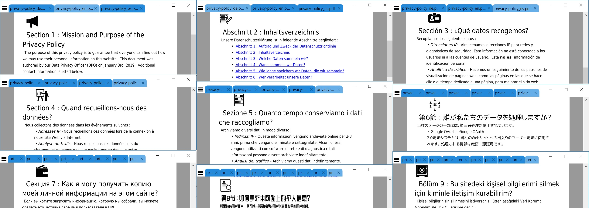

# PHP HTML-to-PDF Converter with UTF-8 Support
## (supports Chinese, Japanese, European, etc.)

This project provides a simple, easy-to-use HTML-to-PDF converter in PHP, with full, out-of-the-box support for UTF-8 and non-Latin-based languages.

<p align="center"></p>

## Demos

* [German PDF](https://www.revoltlib.com/privacy.pdf?language=de) / [German HTML Source](https://www.revoltlib.com/privacy.php?language=de&printerfriendly=1)
* [English PDF](https://www.earthfluent.com/privacy.pdf?language=en) / [English HTML Source](https://www.revoltlib.com/privacy.php?language=en&printerfriendly=1)
* [Spanish PDF](https://www.copyleftlicense.com/privacy.pdf?language=es) / [Spanish HTML Source](https://www.revoltlib.com/privacy.php?language=es&printerfriendly=1)
* [French PDF](https://www.listkeywords.com/privacy.pdf?language=fr) / [French HTML Source](https://www.revoltlib.com/privacy.php?language=fr&printerfriendly=1)
* [Japanese PDF](https://www.sortwords.com/privacy.pdf?language=ja) / [Japanese HTML Source](https://www.revoltlib.com/privacy.php?language=ja&printerfriendly=1)
* [Italian PDF](https://www.pronouncethat.com/privacy.pdf?language=it) / [Italian HTML Source](https://www.revoltlib.com/privacy.php?language=it&printerfriendly=1)
* [Dutch PDF](https://www.revoltlink.com/privacy.pdf?language=nl) / [Dutch HTML Source](https://www.revoltlib.com/privacy.php?language=nl&printerfriendly=1)
* [Polish PDF](https://www.wordweight.com/privacy.pdf?language=pl) / [Polish HTML Source](https://www.revoltlib.com/privacy.php?language=pl&printerfriendly=1)
* [Portuguese PDF](https://www.removeblanklines.com/privacy.pdf?language=pt) / [Portuguese HTML Source](https://www.revoltlib.com/privacy.php?language=pt&printerfriendly=1)
* [Russian PDF](https://www.removeduplicatelines.com/privacy.pdf?language=ru) / [Russian HTML Source](https://www.revoltlib.com/privacy.php?language=ru&printerfriendly=1)
* [Turkish PDF](https://www.removespacing.com/privacy.pdf?language=tr) / [Turkish HTML Source](https://www.revoltlib.com/privacy.php?language=tr&printerfriendly=1)
* [Chinese PDF](https://www.revoltlib.com/privacy.pdf?language=zh) / [Chinese HTML Source](https://www.revoltlib.com/privacy.php?language=zh&printerfriendly=1)

## Dependencies

PHP HTML-to-PDF Converter makes use of :

* tFPDF (based on FPDF 1.7)
* FPDF ("Free PDF")
* DejaVu Language Pack
* ZCOOL_QingKe_HuangYou Chinese Language Pack
* rounded-mgenplus-20140828 Japanese Language Pack

## Sample Use

### English Example

```
	require('../php-html-to-pdf/php-html-to-pdf.php');
	
	$pdf_object = new HTMLtoPDF([
		'Author'=>'HoldOffHunger',
		'Title'=>'Privacy Policy',
	]);
		
	$pdf_object->WriteHTML([
		'html'=>'<h1>I can say hello in English!</h2><p>Hello!</p>',
		'language'=>'en',
	]);

	$pdf_object->Output('file.pdf', "F", TRUE);
```

### Japanese Example

```
	require('../php-html-to-pdf/php-html-to-pdf.php');
	
	$pdf_object = new HTMLtoPDF([
		'Author'=>'HoldOffHunger',
		'Title'=>'Privacy Policy',
	]);
		
	$pdf_object->WriteHTML([
		'html'=>'<h1>I can say hello in 日本人!</h2><p>こんにちは!</p>',
		'language'=>'ja',
	]);

	$pdf_object->Output('file.pdf', "F", TRUE);
```

### Chinese Example

```
	require('../php-html-to-pdf/php-html-to-pdf.php');
	
	$pdf_object = new HTMLtoPDF([
		'Author'=>'HoldOffHunger',
		'Title'=>'Privacy Policy',
	]);
		
	$pdf_object->WriteHTML([
		'html'=>'<h1>I can say hello in 汉语!</h2><p>你好!</p>',
		'language'=>'zh',
	]);

	$pdf_object->Output('file.pdf', "F", TRUE);
```